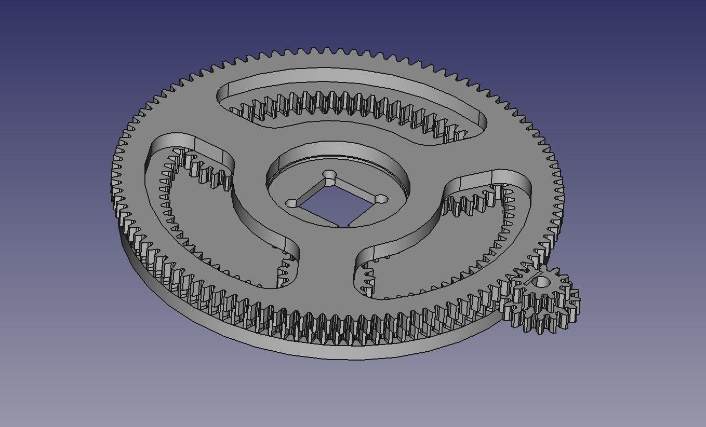
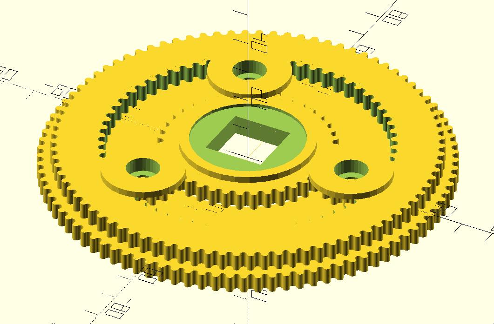

# hSlew

[](LICENSE)

hSlew is a tool to aid in the design of a novel differential planetary
gear system. 

# Basic Usage
hSlew take a path to a config file as it's only arguement. There is a
sample config in './test'. It outputs one solution to the design
constraints per line on stdout; I recommend piping the output into a
log file. Note: no validation is currently done on the config
file, so if you enter unsatisfiable constraints such as hSlew may misbehave.
In particular it's picky about numeric types in the config; only tooth counts are
integers, all other values MUST be entered with a decimal point.

If you've compiled and have the binary on $PATH then:
``` $ hSlew ./path-to/config.toml ```
or if you've just checked out the repo:
``` $ cabal new-run hSlew ./path-to/config.toml ```

# Annotated Example Config
Note: in what follows "gear module" refers to the mechanical concept of module [wikipedia](https://en.wikipedia.org/wiki/Gear#Standard_pitches_and_the_module_system), and not the programming concept.

```
# Sets the minimum diameter of the sun gear, this is useful because the sun gear,
# which is the output of the mechanism, may need to fit onto an existing shaft.
# Units are the same as those in the gear module parameter, typically mm.
minSunDiam = 12.0

# Set min and max number of teeth on all of the components. a minimum is useful
# since spur gears behave poorly with fewer than ~11 teeth. the maximum mostly
# reduces the search space for a solution.
maxNumTeeth = 100
minNumTeeth = 11

# Set range of gear module. For 3d printing, do some test prints to determine
# the lowest gear module you are able to print accurately. Currently min and max
# module must be distinct, so if you want a specific module, set the min to the
# desired module, and max to a value very slightly larger, e.g. 0.5 and 0.50001.
# this will produce near duplicate results in the output.
minModule = 0.5
maxModule = 0.7

# Allows you to enforce a minimum size for the planets to accomodate ball bearings.
# Units are the same as those in the gear module parameter, typically mm.
minPlanetDiam = 10.0

# Sets a maximum size for all components. useful to ensure clearance near other
# mechanisms and to ensure the design will fit on your print bed.
# Units are the same as those in the gear module parameter, typically mm.
maxDiam = 70.0

# These set the range for the absolute value of the desired gear reduction ratio.
# note that this mechanism is capable of producing negative (reversing) as well
# as positive (non-reversing) ratios. There is currently no way to specify to hSlew
# whether you want a reversing or non-reversing drive, but the output ratio is
# signed to indicate that.
minRatio = 5000.0
maxRatio = 6500.0

# Set minimum thickness for the floating ring gear.
# Units are the same as those in the gear module parameter, typically mm.
minDeltaRing = 12.0
```
# Interpreting the Output
Each line of output is simply the raw "show"ed Haskell data type.
```
Design {sunTeeth = 51, planetTeeth = 15, ringInnerTeeth = 81, ringOuterTeeth = 99, carrierTeeth = 120, ringDriveTeeth = 82, carrierDriveTeeth = 61, ratio = 5610.000000005102, c2cDist = 63.350000000000016, gearModule = 0.7000000000000002, planetPositions = [(23.100000000000005,0.0),(-11.549999999999997,20.005186827420538),(-11.550000000000013,-20.00518682742053)]}
```
In this sample output, most of the parameters should be self explanatory.
c2cDist is the distance, in the same units as appear in the gear module,
between the axis of the sun gear and the axis of the compound drive gear.
The planets in this mechanism are in general *not* equally spaced around
the sun! The last parameter of the output, planetPositions, is a list of 
the (x,y) coords of the (currently hardcoded to 3) planets, in the same
units as module again.
# Design Usage
TODO: give description of differential planetary gear set topology, and
discussion of design considerations.



## OpenSCAD
To generate a differential drive with OpenSCAD, cut and paste one
entry from the output of hSlew into the noted section of DiffDrive.scad

